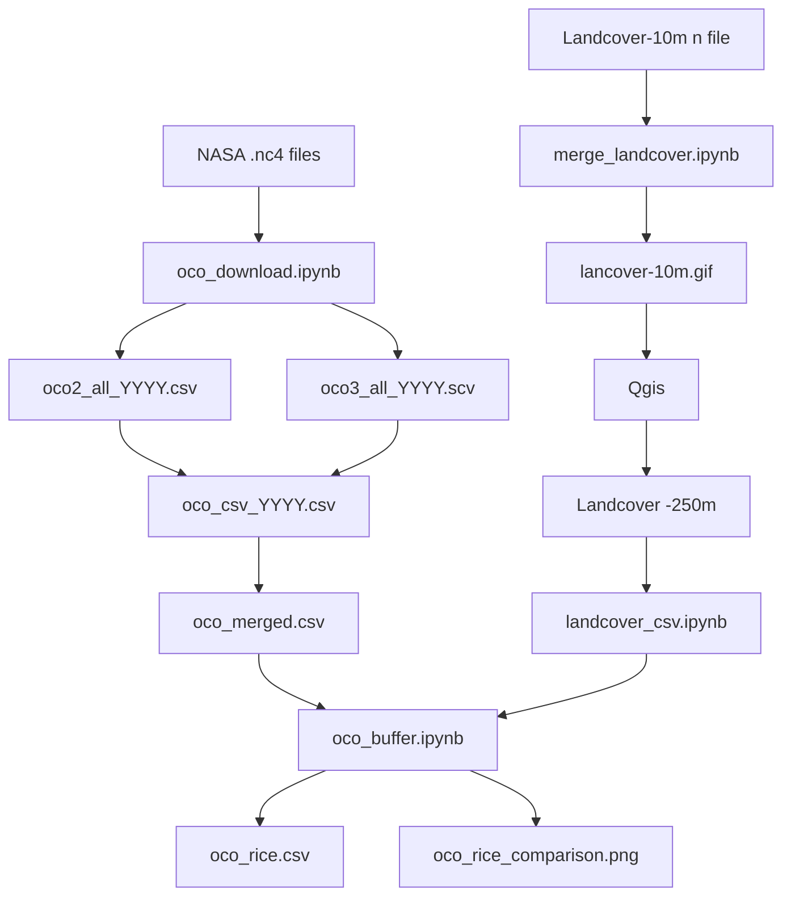

# Hướng dẫn sử dụng dữ liệu OCO (Orbiting Carbon Observatory)

## Cấu trúc thư mục `data/csv/`

Dữ liệu OCO được tổ chức theo các năm từ 2020-2024, mỗi năm chứa các file CSV đã được xử lý:

### Các loại file chính trong mỗi năm:

#### 1. **`oco_merged_YYYY.csv`** - File dữ liệu gộp chính
- **Mục đích**: Dữ liệu CO₂ đã được gộp từ OCO-2 và OCO-3, lọc theo chất lượng cao, lọc theo ranh giới việt nam từ các năm
- **Nội dung**: 
  - `file_date`: Ngày đo
  - `latitude`, `longitude`: Tọa độ điểm đo
  - `sza`, `vza`: Góc zenith mặt trời và cảm biến
  - `xco2`: Nồng độ CO₂ cột (ppm)
  - `xco2_sigma`: Độ không chắc chắn
  - `xco2_qual`: Cờ chất lượng (0 = tốt nhất)
  - `time`: Thời gian đo chính xác
  - `GID_0`, `COUNTRY`: Mã và tên quốc gia

#### 2. **`oco_count_YYYY.csv`** - Thống kê số điểm đo theo tỉnh
- **Mục đích**: Đếm số lượng điểm đo CO₂ trong từng tỉnh/thành phố Việt Nam
- **Nội dung**: Thông tin hành chính và cột `CO2_COUNT` (số điểm đo)

#### 3. **`oco_rice_YYYY.csv`** - Dữ liệu CO₂ trong vùng trồng lúa
- **Mục đích**: Chỉ chứa các điểm đo CO₂ nằm trong khu vực trồng lúa
- **Cách tạo**: Lọc từ `oco_merged` bằng buffer 500m và ngưỡng 50% pixel lúa. Theo file code `oco_buffer`

#### 4. **`oco_rice_flag_YYYY.csv`** - Dữ liệu gốc có cờ đánh dấu vùng lúa
- **Mục đích**: File gốc với thêm cột `is_rice_area` (True/False)
- **Ứng dụng**: Phân tích so sánh CO₂ giữa vùng lúa và không lúa

#### 5. **`oco_pixel_YYYY.csv`** - Dữ liệu có thông tin pixel (2023-2024)
- **Mục đích**: Bổ sung thông tin về pixel landcover tại điểm đo
- **Cột thêm**: `SAMPLE_1` - giá trị landcover từ bản đồ ALOS

#### 6. **`oco_rice_comparison_YYYY.png`** - Biểu đồ so sánh
- **Mục đích**: Hình ảnh so sánh nồng độ CO₂ giữa vùng lúa và không lúa

### Thư mục con `oco2/` và `oco3/`
Chứa dữ liệu riêng biệt từ từng vệ tinh OCO-2 và OCO-3 trước khi gộp.

---

## Hướng dẫn sử dụng các Notebook

### 1. **`oco_download.ipynb`** - Tải dữ liệu từ NASA
- **Chức năng**: Tải file .nc4 từ NASA Earthdata
- **Input**: File danh sách URL (.txt)
- **Output**: File .nc4 trong thư mục `data/nc4/`
- **Yêu cầu**: Tài khoản NASA Earthdata, file .env với username/password

### 2. **`oco_csv.ipynb`** - Chuyển đổi NC4 sang CSV
- **Chức năng**: 
  - Đọc file .nc4 và trích xuất dữ liệu CO₂
  - Lọc theo ranh giới Việt Nam
  - Lọc theo chất lượng dữ liệu (quality flag = 0)
  - Gộp dữ liệu từ nhiều file
- **Input**: File .nc4 trong `data/nc4/`
- **Output**: File CSV trong `data/csv/`

### 3. **`oco_buffer.ipynb`** - Lọc dữ liệu vùng trồng lúa
- **Chức năng**:
  - Tạo buffer 500m quanh mỗi điểm CO₂
  - Kiểm tra tỷ lệ pixel lúa trong buffer
  - Lọc điểm có ≥50% diện tích là lúa
  - Vẽ biểu đồ
- **Input**: File `oco_merged_YYYY.csv` + bản đồ landcover ALOS
- **Output**: `oco_rice_YYYY.csv`, `oco_rice_flag_YYYY.csv`

### 4. **`oco_rice.ipynb`** - Cũng tương tự oco_buffer 


### 5. **`oco_VNM_1.ipynb`** - Lọc theo khu vực cụ thể
- **Chức năng**: Lọc dữ liệu theo shapefile (ví dụ: chỉ lấy dữ liệu Hà Nội)

### 6. **`landcover_csv.ipynb`** - Xử lý bản đồ landcover
- **Chức năng**: Chuyển đổi file raster landcover (.tif) sang CSV

### 7. **`merge_landcover.ipynb`** - Gộp bản đồ landcover
- **Chức năng**: Gộp nhiều file raster thành một file duy nhất

---

## Quy trình xử lý dữ liệu



### Bước 1: Tải dữ liệu
```python
# Chạy oco_download.ipynb để tải file .nc4 từ NASA
```

### Bước 2: Chuyển đổi và lọc
```python
# Chạy oco_csv.ipynb để:
# - Chuyển .nc4 → CSV
# - Lọc theo Việt Nam
# - Lọc theo chất lượng
```

### Bước 3: Phân tích vùng lúa
```python
# Chạy oco_rice.ipynb để lọc điểm trong vùng trồng lúa
```

